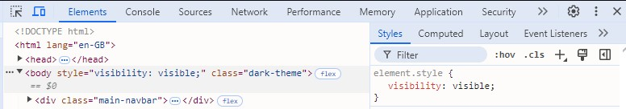
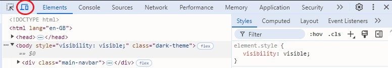
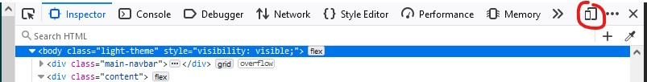
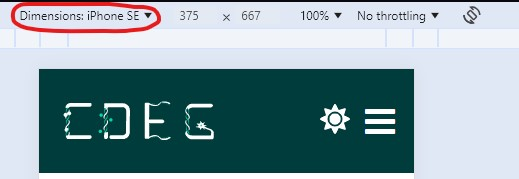

# Developers: Mobile development

The site might look nice on your big 16:9 monitor, but does it look nice on the
latest smart toothbrush? Making a site scalable to multiple devices is a bit of
a pain, but it is necessary.

If you want any help on how to get started with making websites responsive to
different devices, I recommend reading 
[this page from w3schools](https://www.w3schools.com/html/html_responsive.asp).

## How to check the site for mobile devices

If you are using a modern browser, you should have access to a developer view
for websites. This view will allow you to see the html, the computed styles of
elements, the console and much more. Every browser has their own way of opening
up this view (so I can't give perfect instructions on how to open it), but you
should be able to find the option in the dropdown list when you right click on
the background of a website.

Once you're in this view, you should see something like this on the right:

To see how the website looks under lots of different mobile devices, click on
the little mobile button:

From here, you will open up the website from the perspective of a phone. You
can change the phone type using this dropdown menu:

You can also create your own dimensions on some browsers (it might be under a
'edit' button or 'responsive' button). Some browsers have further capabilities
of manipulating the device dimensions by  resizing the window. Use these views
to see how the website looks on different devices. If something doesn't look
good, try to fix it.

### Quirks

I have tried lots of browsers to see which ones are good for mobile
development. The problem comes with conditional javascript and media queries in
the code base. If the site looks awful (some stuff not showing *etc.*), it
might not be your fault. Before getting mad at why it isn't working, try to
reload the page (not refresh the page, reload the page by navigating to it
again) or change to a different device (and change back). It's fustrating, but
I have found that doing a combination of these usually fixes problems that I
know shouldn't be there.

I have heard good things about firefox for web development, but small quirks
like this kept me away from using it. If you are interested, I found less
issues with using [vivaldi](https://vivaldi.com). Use whatever you think is
best.

## Width thresholds

The media queries on the site all use the width thresholds outlined in the
`global_variables.scss` partial. I did this so that it is easier to get pages
to agree with one another for different devices. In general, the
`$tablet_threshold_width` is the most important one . From testing, it is
around this point where the site benefits from having a redesign as each page
and the header gets too cramped. The other thresholds are in place for the same
reason, but in more specific cases. For example, the funders page looks bad
with a single column of funders on tablets, but bad with a grid on thin phones
(so a distinction is required).

These thresholds are in no way fixed at all, you can add more, delete some,
change the values, whatever. The important thing it to stick with using
these variables so that refactoring is easier in the future.
